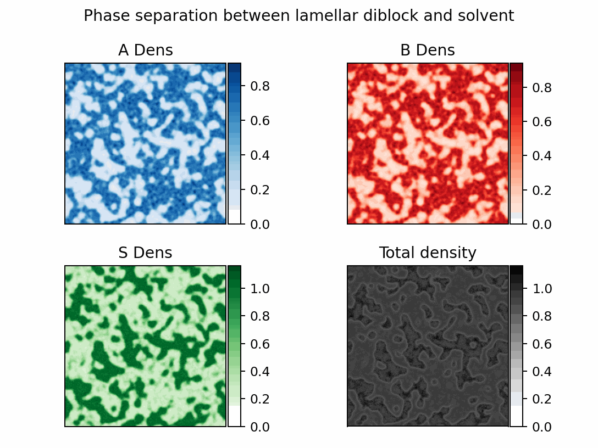

Here is a sample file that will generate a diblock copolymer melt with some solvent. 

When you run the file, if it's working then you should see numbers counting to 40 and 
once they're done a video of the solver finding
the local minimum of energy, which looks something like this:



This file actually contains basically all the details you need to run any simulation, 
and modifications of it are generally enough to produce most different configurations. 

Most of the work is in the setup bit of the file which just requires a few steps. 

The first thing we need to configure is what types of monomers are going to be in the
system. This is done in two steps. First, we declare that they exist (and specify their
name and charge). 

```python
A_mon = p.Monomer("A", 0)
B_mon = p.Monomer("B", 0)
S_mon = p.Monomer("S", 0)
```

Then we package them into a list we can hand to the method later. 

```python
monomers = [A_mon, B_mon, S_mon]
```

Now we want to specify what the interactions between these monomers are in this case we
are going to use one interaction for like species and one interaction for different 
species. 

```python
tot = 130
diff = 15.2
```

We want to make a dictionary that actually stores the interactions in a pairwise fashion
so we use a dictionary that maps frozensets (which hold the pair efficiently and can be 
used as a dictionary key) and the values of $\chi_{ij} N$. These values were selected
to give nice separation but still be stable. 

```
FH_terms = {
    frozenset({A_mon}): tot,
    frozenset({B_mon}): tot,
    frozenset({S_mon}): tot,
    frozenset({A_mon, B_mon}): tot + diff,
    frozenset({A_mon, S_mon}): tot + diff,
    frozenset({B_mon, S_mon}): tot + diff,
}
```

At this point, we need to tell the system what types of polymers are in the system. We 
are going to specify one polymer, with a length of 5 units (solvent has 1) that is half
A and half B. Since we only have one polymer, the list of polyer types is just that one
polymer, but with more we would declear them separately and put them together. 

```python
N = 5
AB_poly = p.Polymer("AB", N, [(A_mon, 0.5), (B_mon, 0.5)])
polymers = [AB_poly]
```

Now we tell the system how much of all the species types we want to add. It's good 
practice to have the total density sum to 1, as this is the default interpretation for 
our FH parameters, but it can be set to any value and will usually be different if you 
are matching an external system. We just specify which species there are and how much 
density they have. This counts the number of that species, so shorter species need more 
numbers to give the same monomer count. 

```python
spec_dict = {AB_poly: 0.5, S_mon: 0.5 * N}
```

The last thing we need to determine is how our system will be configured. We want to 
specify how big the system size is (in units of $R_g$) and how many grid points we're 
going to use. This choice also determines the dimensionality of the system. 

```python
grid_spec = (256, 256)
box_length = (90, 90)
```

We will also specify the smearing length for the system. This parameter is related to 
the range of the interaction between different monomer units. 
```python
smear = 0.2
```

Now we're ready to declare our system. We just slot all the parameters we've established
into their proper locations and can set up the polymer simulation. 
By default, the system will set the global $N$ value equal to the longest polymer in the
system to normalize things. 
Note that we've also
said not to add any salt and set the integration length (this is a fraction of the 
system N). 

```python
ps = p.PolymerSystem(
    monomers,
    polymers,
    spec_dict,
    FH_terms,
    grid,
    smear,
    salt_conc=0.0 * N,
    integration_width=1 / 10,
)
```

Our system is now configured, but we need to tell it how to integrate everything. We'll
use an appropriate step size and a cold temperature to reduce the noise. 

```python
relax_rates = cp.array([0.45] * (ps.w_all.shape[0]))
temps = cp.array([0.001 + 0j] * (ps.w_all.shape[0]))
temps *= ps.gamma.real
```

Here we're setting the temperatures to only apply to the real fields. This is one of the
valid integration schemes available. 

We're also going to turn off any electrostatic interactions by setting our $E$ parameter
to zero, and turning the update size on the psi fields to 0 for good measure. 

```python
E = 0
psi_rate = 0
psi_temp = 0
```

To integrate our system, all that we call is ```integrator.ETD()``` repeatedly. The 
rest of the code is mostly fancy plotting techniques and instructions to save the 
trajectory of the run and intermediate steps. But at this point, we should have 
successfully run a polymer simulation. The full code will be placed below, but this 
and other example runs can found in the examples directory. They provide a strong 
template even for complex calculations like proteins or coacervates.  


```python
{!../examples/diblock.py!}
```

